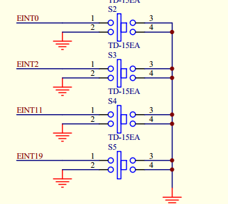

### 目录  
#### 第005节 [字符设备驱动程序之查询方式的按键驱动程序](#字符设备驱动程序之查询方式的按键驱动程序)  
#### 第006节 [字符设备驱动程序之中断方式的按键驱动_Linux异常处理结构](#字符设备驱动程序之中断方式的按键驱动_Linux异常处理结构)  
#### 第007节 [字符设备驱动程序之中断方式的按键驱动_Linux中断处理结构](#字符设备驱动程序之中断方式的按键驱动_Linux中断处理结构)  
#### 第009节 [字符设备驱动程序之poll机制](#字符设备驱动程序之poll机制)  
#### 第010节 [字符设备驱动程序之异步通知](#字符设备驱动程序之异步通知)    
#### 第011节 [字符设备驱动程序之同步互斥阻塞](#字符设备驱动程序之同步互斥阻塞)  

#### 字符设备驱动程序之查询方式的按键驱动程序  
实现目的：以查询方式查看按键是否被按下  

1. 写出框架  
可以参照已有的c.json文档  

2. 配置寄存器，也就是硬件操作  
查看先关的原理图，确定是那些寄存器，引脚。  
查看外部的设备GPF0,GPF2,GPG3

  

使用查询意味着把它们设置为输入方式：  
包含在寄存器GPFCON和GPFDAT中。  

open函数中初始化寄存器。

```c{.lines-numbers}
//set regs
*gpfcon &= ~((0x3<<4) | (0x3<<0));
*gpgcon &= ~((0x3<<(3*2)) | (0x3<<(11*2)));
```
read函数读取寄存器的值    
```
//read regs
unsigned char key_vals[4];
int regval;
if (size != sizeof(key_vals))
    return -EINVAL;
/* 读GPF0,2 */
regval = *gpfdat;
key_vals[0] = (regval & (1<<0)) ? 1 : 0;
key_vals[1] = (regval & (1<<2)) ? 1 : 0;

/* 读GPG3,11 */
regval = *gpgdat;
key_vals[2] = (regval & (1<<3)) ? 1 : 0;
key_vals[3] = (regval & (1<<11)) ? 1 : 0;

copy_to_user(buf, key_vals, sizeof(key_vals));
```
#### 字符设备驱动程序之中断方式的按键驱动_Linux异常处理结构  
#### 字符设备驱动程序之中断方式的按键驱动_Linux中断处理结构

原有的查询方式看寄存器的值非常不佳，现在考虑加入中断。没中断就保持睡眠。  

```c{.line-numbers}
//可以参照arch/arm/plat-s3c24xx/irq.c
int request_irq(unsigned int irq,
		irq_handler_t handler,
		unsigned long irqflags, 
        const char * devname, 
        void *dev_id)

request_irq(IRQ_EINT0,  buttons_irq, IRQT_BOTHEDGE, "S2", &pins_desc[0]);

static irqreturn_t buttons_irq(int irq, void *dev_id)

```

request_irq参数  
1. 中断号  
```c{.line-numbers}
//具体看有哪些中断号可以参照对应平台下面的irqs.h
./include/asm-arm/arch-s3c2410/irqs.h
./arch/arm/plat-s3c24xx/irq.c
./Documentation/arm/Samsung-S3C24XX/Suspend.txt

```
2. 中断处理函数的函数名  
3. 中断触发条件flag  
4. 名字（就是一段字符串）  
5. 共享中断号dev_id  
分配一个irqaction结构放入irq_desc[irq]  
然后设置引脚，使能中断。  

free_irq参数
1. irq  
2. dev_id  
出链，然后禁止中断。  

考虑到一个个的查看寄存器比较麻烦，这里导入引脚描述结构体  
```c{.line-numbers}
struct pin_desc{
	unsigned int pin; //引脚地址
	unsigned int key_val; //引脚地址对应的值
};

//读出引脚的值
unsigned int s3c2410_gpio_getpin(unsigned int pin)
{
	void __iomem *base = S3C24XX_GPIO_BASE(pin);
	unsigned long offs = S3C2410_GPIO_OFFSET(pin);
	return __raw_readl(base + 0x04) & (1<< offs);
}

struct pin_desc pins_desc[4] = {
	{S3C2410_GPF0, 0x01}, //这里1,2,3,4只是表示dev_id
	{S3C2410_GPF2, 0x02},
	{S3C2410_GPG3, 0x03},
	{S3C2410_GPG11, 0x04},
};

```

关于休眠的处理  

```c{.line-numbers}
/* 中断事件标志, 中断服务程序将它置1，third_drv_read将它清0 */
static volatile int ev_press = 0;
static irqreturn_t buttons_irq(int irq, void *dev_id)
{
    ev_press = 1;                  /* 表示中断发生了 */
    wake_up_interruptible(&button_waitq);   /* 唤醒休眠的进程 */

}
ssize_t xxx_read(xxx)
{
	/* 如果没有按键动作, 休眠 */
	wait_event_interruptible(button_waitq, ev_press);
```
#### 字符设备驱动程序之poll机制  

poll是一种查询机制，等上一段时间就返回。  
应用程序：open、	read、	   write、 	   poll  
应用程序的函数最终会调用系统函数：sys_open、sys_read、sys_write、 sys_poll  
驱动程序：drv_open、drv_read、 drv_write、 drv_poll  

```c{.line-numbers}
static DECLARE_WAIT_QUEUE_HEAD(button_waitq);
static inline void poll_wait(struct file * filp, wait_queue_head_t * wait_address, poll_table *p);
static unsigned forth_drv_poll(struct file *file, poll_table *wait)
{
	unsigned int mask = 0;
	poll_wait(file, &button_waitq, wait); // 不会立即休眠
	//button_waitq在这里是定义好的等待队列
	if (ev_press)
		mask |= POLLIN | POLLRDNORM;
	return mask;
}
```
系统调用方式  
```c{.line-numbers}
	struct pollfd fds[1];	
	fd = open("/dev/buttons", O_RDWR);
	if (fd < 0)
	{
		printf("can't open!\n");
	}

	fds[0].fd     = fd;
	fds[0].events = POLLIN;
	while (1)
	{
		ret = poll(fds, 1, 5000);
		if (ret == 0)
		{
			printf("time out\n");
		}
		else
		{
			read(fd, &key_val, 1);
			printf("key_val = 0x%x\n", key_val);
		}
	}
```

[linux驱动编写之poll机制](https://www.cnblogs.com/amanlikethis/p/6915485.html)  

返回：[目录](#目录)  

#### 字符设备驱动程序之异步通知  

已知的几种获取按键值的方式  
1. 查询，消耗资源太多。完全不推荐  
2. 中断，读的时候会休眠，read函数没有触发中断会一直休眠。    
3. poll机制指定超时时间  
以上三种都是应用程序主动读取/查询  
4. 异步通知  
驱动程序提醒/触发应用程序去读取
进程之间发信号，这里的信号不同于内核中的信号，应该是应用程序中的信号函数。需要调用库函数 `#include <signal.h>`  


异步通知要点  
1. 注册一个信号处理函数  
2. 谁来发送这个信号  
3. 这个信号谁负责接收 
4. 怎么发送信号  

```c{.line-numbers}
#include <stdio.h>
#include <signal.h>

//my_signal_fun信号对应的处理函数
void my_signal_fun(int signum) //signum：信号的值
{
	static int cnt = 0;
	printf("signal = %d, %d\n",signum,++cnt);
}
int main(int argc,char **argv)
{
	//1. 注册一个信号处理函数 
	signal(SIGUSR1,my_signal_fun);
	//SIGUSR1 用户自定义信号 默认处理：进程终止
	//SIGUSR2 用户自定义信号 默认处理：进程终止
	
	while(1)
	{
		sleep(1000);
	}
	return 0;
}

应用程序执行：
./signal & //后台执行
ps 获知signal进程号，例如 PID 833 833是系统给signal的进程号
UID是用户ID，PID是进程ID，PPID是父进程ID
kill命令发送命令 注意只认可进程号，进程名字不会被识别
kill -USR1 833
或者
kill -10 833 //10这里是因为my_signal_fun明确打印signum = 10
9信号处理函数默认退出进程
kill -9 833
```

>kill 从字面来看，就是用来杀死进程的命令，但事实上，这个或多或少带有一定的误导性。从本质上讲，kill 命令只是用来向进程发送一个信号，至于这个信号是什么，是用户指定的。
也就是说，kill 命令的执行原理是这样的，kill 命令会向操作系统内核发送一个信号（多是终止信号）和目标进程的 PID，然后系统内核根据收到的信号类型，对指定进程进行相应的操作。  

[Linux kill命令详解：终止进程](http://c.biancheng.net/view/1068.html)  

```shell{.line-numbers}
[root@localhost ~]# kill [信号] PID  
```
[Linux的SIGUSR1和SIGUSR2信号](https://www.cnblogs.com/kex1n/p/8296332.html)  
[利用Linux信号SIGUSR1调试程序](https://www.cnblogs.com/zafu/p/9267215.html)  

在驱动程序中：按下按键，驱动程序通知应用程序。就是通过信号来完成这部分内容。  
1.应用程序中注册信号处理函数  
2.谁发送信号：驱动发送信号  
3.发给谁：应用程序接收。  
应用程序告诉内核（驱动），应用程序的PID进程号。  
4.怎么发： kill_fasync [linux驱动的异步通知（kill_fasync,fasync）](https://blog.csdn.net/psvoldemort/article/details/21184525)  

[浅析 Linux fasync 异步通知](https://blog.csdn.net/lizuobin2/article/details/52705254)  

驱动中的处理方式  
为了使设备支持异步通知机制，驱动程序中涉及以下3项工作：
1. 支持F_SETOWN命令，能在这个控制命令处理中设置filp->f_owner为对应进程ID。  
不过此项工作已由内核完成，设备驱动无须处理。  
2. 支持F_SETFL命令的处理，每当FASYNC标志改变时，驱动程序中的fasync()函数将得以执行。  
驱动中应该实现fasync()函数。  
3. 在设备资源可获得时，调用kill_fasync()函数激发相应的信号  
```c{.line-numbers}
/drivers/char/
struct fasync_struct *fasync;
kill_fasync(fasync, SIGIO, POLL_IN);
//fasync包含进程ID发给谁，
//POLL_IN有数据读取
```

这部分操作可以考虑放在中断响应函数中处理,也就是在中断处理的时候发送信号。告诉应用层APP，可以读取数据了。    
fasync初始化操作：  
```c{.line-numbers}
//在驱动部分的xxx_drv_fasync完成初始化操作
fasync_helper(fd, filp, on, &fasync);
static int xxx_drv_fasync (int fd, struct file *filp, int on)
{
	return fasync_helper (fd, filp, on, &fasync);
}
//对应应用层的fcntl(fd, F_SETFL, Oflags | FASYNC);
```

应用层部分,其实在应用层启用异步通知只三个步骤：  
1. 调用signal函数，让指定的信号SIGIO与处理函数my_signal_fun对应  
```c{.line-numbers}
void my_signal_fun(int signum)
{
	unsigned char key_val;
	read(fd, &key_val, 1); //在信号的响应函数中读取数据
	printf("key_val: 0x%x\n", key_val);
}
signal(SIGIO, my_signal_fun); 
```
2. 打开相关的设备节点：
```c{.line-numbers}
fd = open("/dev/buttons", O_RDWR);
if (fd < 0)
{
	printf("can't open!\n");
}
``` 
3. 指定一个进程作为文件的“属主(filp->owner)”，这样内核才知道信号要发给哪个进程。发给谁  
```c{.line-numbers}
fcntl(fd, F_SETOWN, getpid());  
```  
4. 在设备文件中添加FASYNC标志，驱动中就会调用将要实现的test_fasync函数  
```c{.line-numbers}
f_flags = fcntl(fd, F_GETFL);  
fcntl(fd, F_SETFL, f_flags | FASYNC);  //设置设备程序支持异步通知
//调用驱动层的xxx_drv_fasync
```  
三个步骤执行后，一旦有信号产生，相应的进程就会收到。  

返回：[目录](#目录)  

#### 字符设备驱动程序之同步互斥阻塞  

目的：同一时刻，只有一个应用程序打开驱动程序。  
严格意义上，同步互斥的目的该是确保同一段内存上只有一个进程可以操作。为达到这个目的，需要考虑下面几种方法：  
原子变量操作、自旋锁、信号量和完成量。  

1. 原子操作  
原子操作指的是在执行过程中不会被别的代码路径所中断的操作。  
常用原子操作函数举例：  
```c{.line-numbers}
atomic_t v = ATOMIC_INIT(0);     //定义原子变量v并初始化为0  
atomic_read(atomic_t *v);        //返回原子变量的值  
void atomic_inc(atomic_t *v);    //原子变量增加1  
void atomic_dec(atomic_t *v);    //原子变量减少1 
int atomic_dec_and_test(atomic_t *v); //自减操作后测试其是否为0，为0则返回true，否则返回false。
```
2. 信号量  
信号量（semaphore）是用于保护临界区的一种常用方法，只有得到信号量的进程才能执行临界区代码。  
当获取不到信号量时，进程进入休眠等待状态。  
```c{.line-numbers}
//定义信号量
struct semaphore sem;
//初始化信号量
void sema_init (struct semaphore *sem, int val);
void init_MUTEX(struct semaphore *sem);//初始化为0

static DECLARE_MUTEX(button_lock);     //定义互斥锁

//获得信号量
void down(struct semaphore * sem);
int down_interruptible(struct semaphore * sem); 
int down_trylock(struct semaphore * sem);
//释放信号量
void up(struct semaphore * sem);
```

阻塞操作  
是指在执行设备操作时若不能获得资源则挂起进程，直到满足可操作的条件后再进行操作。  
被挂起的进程进入休眠状态，被从调度器的运行队列移走，直到等待的条件被满足。  

非阻塞操作  
进程在不能进行设备操作时并不挂起，它或者放弃，或者不停地查询，直至可以进行操作为止。  

```c{.line-numbers}
file->f_flags由于内核提供
if (file->f_flags & O_NONBLOCK)
{
	//O_NONBLOCK非阻塞
	if (down_trylock(&button_lock))
		return -EBUSY;
}
else
{
	/* 获取信号量 */
	down(&button_lock);
}
```
返回：[目录](#目录)  
