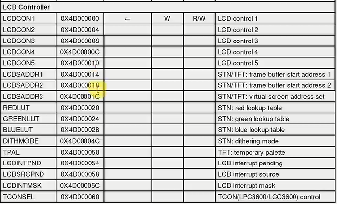
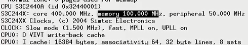

## 目录   

第15课 LCD驱动程序  
[LCD驱动程序之层次分析 1](#lcd驱动程序之层次分析-1)       
[LCD驱动程序之硬件操作 2](#lcd驱动程序之硬件操作-2)     
[LCD驱动程序之编写代码之1初步编写 3](#lcd驱动程序之编写代码之1初步编写-3)   
[LCD驱动程序之编写代码之2硬件设置 4](#lcd驱动程序之编写代码之2硬件设置-4)  
[LCD驱动程序之编写代码之3显存和调色板设置 5](#lcd驱动程序之编写代码之3显存和调色板设置-5)  
[LCD驱动程序之编译测试-6](#lcd驱动程序之编译测试-6)  
[补录_JZ2440V2V3(4.3寸)LCD驱动程序(7)LCD7](#lcd7)  

#### LCD驱动程序之层次分析 1
LCD的大致步骤：  
1. 主设备号
2. file_operations  
3. register_chrdev  
4. 入口  
5. 出口  

LCD驱动程序参考内核文件fbmem.c  

假设  
```c{.line-numbers}
app:open("/dev/fb0", ...)   主设备号: 29, 次设备号: 0
kernel:
static int
fb_open(struct inode *inode, struct file *file)
{
	int fbidx = iminor(inode); //次设备号
	struct fb_info *info; //framebuffer 帧缓冲区

	struct fb_info *info = registered_fb[0];

--------------------------------------------------------------
app:  read()
kernel:
static ssize_t
fb_read(struct file *file, char __user *buf, size_t count, loff_t *ppos)
{
	int fbidx = iminor(inode);
	struct fb_info *info = registered_fb[fbidx];
	if (info->fbops->fb_read)
		return info->fbops->fb_read(info, buf, count, ppos);

	//显存的基地址screen_base
	src = (u32 __iomem *) (info->screen_base + p); 
	dst = buffer;
	*dst++ = fb_readl(src++); //读到一个数据
	copy_to_user(buf, buffer, c) 

static int __init
fbmem_init(void)
{
	create_proc_read_entry("fb", 0, NULL, fbmem_read_proc, NULL);

	if (register_chrdev(FB_MAJOR,"fb",&fb_fops))
		printk("unable to get major %d for fb devs\n", FB_MAJOR);

	fb_class = class_create(THIS_MODULE, "graphics");
	if (IS_ERR(fb_class)) {
		printk(KERN_WARNING "Unable to create fb class; errno = %ld\n", PTR_ERR(fb_class));
		fb_class = NULL;
	}
	return 0;
}

读和open都依赖于fb结构体  
问1. registered_fb在哪里被设置？  
答1. register_framebuffer  
```
返回：[目录](#目录)  

#### LCD驱动程序之硬件操作 2  

怎么找到合适的LCD实例代码：`register_framebuffer`,参照s3c2410fb.c  

怎么写LCD驱动程序  
1. 分配一个fb_info结构体: framebuffer_alloc  
2. 设置  
3. 注册: register_framebuffer  
4. 硬件相关的操作  

设置  
电子枪，通过时钟VCLK每来个时钟就发送一个信号VD给它颜色信号数据。通过行同步信号知道要换行了。同步信号由垂直方向的。颜色从显存中得到。  

硬件操作：  
1. 根据LCD手册，设置LCD控制器  
2. 分配显存，把地址告诉LCD控制器  
包括颜色什么的  
3. 配置引脚用于LCD  

返回：[目录](#目录)   

#### LCD驱动程序之编写代码之1初步编写 3
参考s3c2410fb.c  
入口函数：  
调用哪个函数进行分配`framebuffer_alloc`  
调用哪个函数进行注册`register_framebuffer`  
```c{.line-numbers}
static struct fb_info *s3c_lcd;
static int lcd_init(void)
{
	/* 1. 分配一个fb_info */
	s3c_lcd = framebuffer_alloc(0, NULL);
	//0表示不需要额外的空间

	/* 2. 设置 */ 
	//对结构体s3c_lcd也就是static struct fb_info进行配置
	/* 2.1 设置固定的参数 */
	/* 2.2 设置可变的参数 */
	/* 2.3 设置操作函数 */
	/* 2.4 其他的设置 */

	/* 2.1 设置固定的参数 */
	//参照《液晶屏.pdf》
	strcpy(s3c_lcd->fix.id, "mylcd");
	s3c_lcd->fix.smem_len = 240*320*16/8;  
	//16表示RGB的长度是5、6、5
	s3c_lcd->fix.type     = FB_TYPE_PACKED_PIXELS;
	s3c_lcd->fix.visual   = FB_VISUAL_TRUECOLOR; /* TFT */
	s3c_lcd->fix.line_length = 240*2;

	/* 2.2 设置可变的参数 */
	s3c_lcd->var.xres           = 240;
	s3c_lcd->var.yres           = 320;
	s3c_lcd->var.xres_virtual   = 240;
	s3c_lcd->var.yres_virtual   = 320;
	s3c_lcd->var.bits_per_pixel = 16;

	/* RGB:565 */
	s3c_lcd->var.red.offset     = 11;
	s3c_lcd->var.red.length     = 5;
	
	s3c_lcd->var.green.offset   = 5;
	s3c_lcd->var.green.length   = 6;

	s3c_lcd->var.blue.offset    = 0;
	s3c_lcd->var.blue.length    = 5;

	s3c_lcd->var.activate       = FB_ACTIVATE_NOW;	
	
	/* 2.3 设置操作函数 */
	s3c_lcd->fbops              = &s3c_lcdfb_ops;
	
	/* 2.4 其他的设置 */
	//s3c_lcd->pseudo_palette =; //
	//s3c_lcd->screen_base  = ;  /* 显存的虚拟地址 */ 
	s3c_lcd->screen_size   = 240*324*16/8;

	/* 3. 硬件相关的操作 */
	/* 3.1 配置GPIO用于LCD */
	/* 3.2 根据LCD手册设置LCD控制器, 比如VCLK的频率等 */
	/* 3.3 分配显存(framebuffer), 并把地址告诉LCD控制器 */
	//s3c_lcd->fix.smem_start = xxx;  /* 显存的物理地址 */

	/* 4. 注册 */
	register_framebuffer(s3c_lcd);
	
	return 0;
}

```
#### 硬件相关设置  

也就是配置硬件相关寄存器。  

3.1 配置GPIO用于LCD  

需要设置GPC，GPB，GPD，GPG，GPG 这类寄存器。  

[3 硬件相关设置](#3-硬件相关设置)  

3.2 根据LCD手册设置LCD控制器，比如VCLK的频率等  
3.3 分配Framebuffer（显存）并把地址告诉LCD控制器  

返回：[目录](#目录)  

#### LCD驱动程序之编写代码之2硬件设置 4  
对于多个存在连续地址的寄存器而言，一个个的ioremap实在是低效。应该考虑一次性的地址映射  
unsigned long表示4个字节，这就意味着，这些寄存器直接相差也该是4字节。这里地址每次相差1表示一个字节  
[ARM单片机寄存器地址为什么相差4](https://mrs.pub/lpc1114/871.html)  

LCDController寄存器地址  
  
```c{.line-numbers}
struct lcd_regs {
	//
	unsigned long	lcdcon1;
	unsigned long	lcdcon2;
	unsigned long	lcdcon3;
	unsigned long	lcdcon4;
	unsigned long	lcdcon5;
	unsigned long	lcdsaddr1;
	unsigned long	lcdsaddr2;
	unsigned long	lcdsaddr3;
	unsigned long	redlut;
	unsigned long	greenlut;
	unsigned long	bluelut;
	unsigned long	reserved[9];//保留字节
	unsigned long	dithmode;
	unsigned long	tpal;
	unsigned long	lcdintpnd;
	unsigned long	lcdsrcpnd;
	unsigned long	lcdintmsk;
	unsigned long	lpcsel;
};
static volatile struct lcd_regs* lcd_regs;
lcd_regs = ioremap(0x4D000000, sizeof(struct lcd_regs));
```
根据LCDController寄存器地址那里看到`bluelut`的地址是0x4000028而下面的`dithmode`地址0x400004C。相差0x4C-0x28=0x24, 0x24/4 = 0x9，所设置了`unsigned long	reserved[9];`。  

内核频率  
  

返回：[目录](#目录)   
#### LCD驱动程序之编写代码之3显存和调色板设置 5  

内核自带的函数如何分配显存，参照函数 `s3c2410fb_map_video_memory`：  
```c{.line-numbers}
static int __init s3c2410fb_map_video_memory(struct s3c2410fb_info *fbi)
{
	dprintk("map_video_memory(fbi=%p)\n", fbi);

	fbi->map_size = PAGE_ALIGN(fbi->fb->fix.smem_len + PAGE_SIZE);
	fbi->map_cpu  = dma_alloc_writecombine(fbi->dev，fbi->map_size, &fbi->map_dma, GFP_KERNEL);

	fbi->map_size = fbi->fb->fix.smem_len;
```
其中函数`dma_alloc_writecombine` ,落实到代码上面：  


分配显存(framebuffer), 并把地址告诉LCD控制器:  

```c{.line-numbers}
/* 3.3 分配显存(framebuffer), 并把地址告诉LCD控制器 */
s3c_lcd->screen_base = dma_alloc_writecombine(NULL, s3c_lcd->fix.smem_len, &s3c_lcd->fix.smem_start, GFP_KERNEL);
s3c_lcd->fix.smem_start //物理地址	
```
返回：[目录](#目录)  

#### LCD驱动程序之编译测试-6  
1. make menuconfig去掉原来的驱动程序  
```c{.line-numbers}
-> Device Drivers
  -> Graphics support
<M> S3C2410 LCD framebuffer support

```
2. make uImage  
```c{.line-numbers}
   make modules  
```

3. 使用新的uImage启动开发板:    

4.     
```c{.line-numbers}
insmod cfbcopyarea.ko 
insmod cfbfillrect.ko 
insmod cfbimgblt.ko 
insmod lcd.ko

echo hello > /dev/tty1  // 可以在LCD上看见hello
cat lcd.ko > /dev/fb0   // 花屏
```

5. 修改 /etc/inittab    
```c{.line-numbers}
tty1::askfirst:-/bin/sh
用新内核重启开发板

insmod cfbcopyarea.ko 
insmod cfbfillrect.ko 
insmod cfbimgblt.ko 
insmod lcd.ko
insmod buttons.ko
```
返回：[目录](#目录)  
