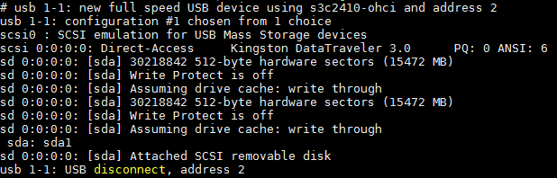

### 006_USB设备驱动(4节)  
#### 目录  
[USB驱动程序之概念介绍](#usb驱动程序之概念介绍)  
[USB驱动程序之USB总线驱动程序](#usb驱动程序之usb总线驱动程序)  
[USB驱动程序之USB设备驱动程序1简单编写](#usb驱动程序之usb设备驱动程序1简单编写)  
[USB驱动程序之USB设备驱动程序2鼠标用作键盘](#usb驱动程序之usb设备驱动程序2鼠标用作键盘)  

参考代码：内核代码usbmouse.c  

#### USB驱动程序之概念介绍  
问1. 既然还没有"驱动程序"，为何能知道是"android phone"  
>答1. windows里已经有了USB的总线驱动程序，接入USB设备后，是"总线驱动程序"知道你是"android phone"提示你安装的是"设备驱动程序"  
USB总线驱动程序负责：识别USB设备, 给USB设备找到对应的驱动程序

USB驱动程序分为两层  
1. 设备驱动（这个距离上层APP近一些，是用户自己需要写的）  
2. USB总线驱动程序（内核自带）  

问2. USB设备种类非常多，为什么一接入电脑，就能识别出来？  
>答2. PC和USB设备都得遵守一些规范。
	比如：USB设备接入电脑后，PC机会发出"你是什么"？
    USB设备就必须回答"我是xxx", 并且回答的语言必须是中文
    USB总线驱动程序会发出某些命令想获取设备信息(描述符)，
    USB设备必须返回"描述符"给PC

问3. PC机上接有非常多的USB设备，怎么分辨它们？  
USB接口只有4条线: 5V,GND,D-,D+ (只有D-,D+这两条线可以用来挂载设备，传输数据)  
>答3. 每一个USB设备接入PC时，USB总线驱动程序都会给它分配一个编号
     接在USB总线上的每一个USB设备都有自己的编号(地址)
     PC机想访问某个USB设备时，发出的命令都含有对应的编号(地址)

问4. USB设备刚接入PC时，还没有编号；那么PC怎么把"分配的编号"告诉它？  
>答4. 新接入的USB设备的默认编号是0，在未分配新编号前，PC使用0编号和它通信。

问5. 为什么一接入USB设备，PC机就能发现它？  
>答5. PC的USB口内部，D-和D+接有15K的下拉电阻，未接USB设备时为低电平
     USB设备的USB口内部，D-或D+接有1.5K的上拉电阻；它一接入PC，就会把PC USB口的D-或D+拉高，从硬件的角度通知PC有新设备接入

其他概念:  
1. USB是主从结构的  
所有的USB传输，都是从USB主机这方发起；USB设备没有"主动"通知USB主机的能力。  
例子：USB鼠标滑动一下立刻产生数据，但是它没有能力通知PC机来读数据，只能被动地等得PC机来读。PC会以连续不断的查询来响应鼠标的滑动  

2. USB的传输类型:  
a. 控制传输：可靠，时间有保证，比如：USB设备的识别过程  
b. 批量传输: 可靠, 时间没有保证, 比如：U盘  
c. 中断传输：可靠，实时，比如：USB鼠标  
d. 实时传输：不可靠，实时，比如：USB摄像头  

3. USB传输的对象：端点(endpoint)  
我们说"读U盘"、"写U盘"，可以细化为：把数据写到U盘的端点1，从U盘的端点2里读出数据  
除了端点0外，每一个端点只支持一个方向的数据传输  
端点0用于控制传输，既能输出也能输入  

4. 每一个端点都有传输类型，传输方向  
只有一个方向，或者一种类型  

5. 术语里、程序里说的输入(IN)、输出(OUT) "都是" 基于USB主机的立场说的。  
比如鼠标的数据是从鼠标传到PC机, 对应的端点称为"输入端点"  
     
6. USB总线驱动程序的作用  
a. 识别USB设备  
b. 查找并安装对应的设备驱动程序  
c. 提供USB读写函数  

USB总线驱动程序负责：识别USB设备, 给USB设备找到对应的驱动程序  
USB驱动也是类似Char驱动那样需要有对应的结构体的：  
下面对usb_driver结构体进行简要的介绍  
1. usb_driver结构体  
2. 驱动支持的设备列表结构体usb_device_id  
3. 初始化usb_device_id结构的宏  
4. USB驱动注册函数usb_register()  

```c{.line-numbers}
//linux-2.6.22.6/include/linux/usb.h
struct usb_driver {
    ...
    ...
};
//示例代码文件
//linux-2.6.22.6/drivers/media/dvb/dvb-usb/a800.c
static struct usb_driver a800_driver = {
	.name		= "dvb_usb_a800",
	.probe		= a800_probe,
	.disconnect = dvb_usb_device_exit,
	.id_table	= a800_table, //usb_device_id
};

//USB驱动注册函数usb_register()
static int __init a800_module_init(void)
{
	int result;
	if ((result = usb_register(&a800_driver))) {
		err("usb_register failed. Error number %d",result);
		return result;
	}
	return 0;
}
```
返回：[目录](#目录)  
#### USB驱动程序之USB总线驱动程序  
```c{.line-numbers}
USB驱动程序框架:

app:   
-------------------------------------------
          USB设备驱动程序      // 知道数据含义
内核 --------------------------------------
          USB总线驱动程序      
// 1. 识别, 
//2. 找到匹配的设备驱动, 
//3. 提供USB读写函数 (它不知道数据含义)
-------------------------------------------
           USB主机控制器
           UHCI OHCI EHCI
硬件        -----------
              USB设备

UHCI: intel,     低速(1.5Mbps)/全速(12Mbps)
OHCI: microsoft  低速/全速
EHCI:            高速(480Mbps)
内核代码linux-2.6.22.6发现了
ohci-s3c2410.c文件s3c2410应该用的是OHCI，也就是微软规范
```
USB总线驱动程序的作用  
1. 识别USB设备  
1.1 分配地址  
1.2 并告诉USB设备(set address)  
1.3 发出命令获取描述符  
描述符的信息可以在include\linux\usb\Ch9.h看到  
2. 查找并安装对应的设备驱动程序  
3. 提供USB读写函数  
把USB设备接到开发板上，看输出信息:  
  
很明确，发现设备是Kingston DataTraveler 3.0的U盘  

在内核目录下搜：  
```shell{.line-numbers}
grep "USB device using" * -nR  
```

```c{.line-numbers}
hub_irq
	kick_khubd
		hub_thread
			hub_events
				hub_port_connect_change
				
					udev = usb_alloc_dev(hdev, hdev->bus, port1);
								dev->dev.bus = &usb_bus_type;
				
					choose_address(udev); // 给新设备分配编号(地址)
					
					
					hub_port_init   // usb 1-1: new full speed USB device using s3c2410-ohci and address 3
						
						hub_set_address  // 把编号(地址)告诉USB设备
						
						usb_get_device_descriptor(udev, 8); 
						// 获取设备描述符usb_device_descriptor
						
						retval = usb_get_device_descriptor(udev, USB_DT_DEVICE_SIZE);
						
						usb_new_device(udev)   
							err = usb_get_configuration(udev); // 把所有的描述符都读出来，并解析
							usb_parse_configuration
							
							device_add  // 把device放入usb_bus_type的dev链表, 
							            // 从usb_bus_type的driver链表里取出usb_driver，
							            // 把usb_interface和usb_driver的id_table比较
							            // 如果能匹配，调用usb_driver的probe
```

返回：[目录](#目录)  
#### USB驱动程序之USB设备驱动程序1简单编写  
《LINUX内核源代码情景分析》  
实验目的：把一个USB鼠标当做按键  
1. 分配input_dev  
2. 设置  
3. 注册  
4. 硬件操作  

怎么写USB设备驱动程序？
1. 分配/设置usb_driver结构体  
.id_table（支持哪些设备）  
.probe（设备连接了）  
.disconnect（设备移除了）  
2. 注册  

参考代码usbmouse.c  
linux-2.6.22.6/drivers/hid/usbhid/usbmouse.c  

id_table的理解可以参照[USB设备驱动之驱动](https://blog.csdn.net/huangweiqing80/article/details/83014292)  
>注意：USB设备与驱动的匹配不是通过name成员来匹配的，而是通过usb_driver 结构体中的成员id_table来匹配
二、设备与驱动的匹配
我们知道，一个驱动可以支持多个设备，那么怎样知道驱动支持哪些设备呢？通过usb_driver结构中的id_table成员就可以完成这个功能。id_table成员描述了一个USB驱动所支持的所有USB设备列表，它指向一个usb_device_id数组。usb_device_id结构体包含了USB设备的制造商ID、产品ID、产品版本、结构类信息。USB设备的EEPROM中的固件程序中就包含了这些信息。当USB设备中的信息和总线上驱动的id_table信息中的一项相同时，就将USB设备与驱动绑定，由于一个驱动可以适用于多个设备，所以id_table表项中可能有很多项。

```c{.line-numbers}
static struct usb_device_id usbmouse_as_key_id_table [] = {
	{ USB_INTERFACE_INFO(USB_INTERFACE_CLASS_HID, USB_INTERFACE_SUBCLASS_BOOT,
		USB_INTERFACE_PROTOCOL_MOUSE) },
	//{USB_DEVICE(0x1234,0x5678)},
	{ }	/* Terminating entry */
};
//子类是boot，SUBCLASS_BOOT，协议是MOUSE就能够支持
```
查找`USB_DEVICE`这个宏  
```c{.line-numbers}
USB_DEVICE (0x077b, 0x2226),
这里厂家ID：0x077b
这里设备ID：0x2226
#define USB_DEVICE(vend,prod) \
	.match_flags = USB_DEVICE_ID_MATCH_DEVICE, .idVendor = (vend), \
			.idProduct = (prod)
```

实验测试：
```c{.line-numbers}
测试1th/2th:
1. make menuconfig去掉原来的USB鼠标驱动
如果不去掉的话，内核还是使用原来的USB驱动
-> Device Drivers 
  -> HID Devices
  <> USB Human Interface Device (full HID) support 

2. make uImage 并使用新的内核启动

3. insmod usbmouse_as_key.ko
4. 在开发板上接入、拔出USB鼠标
```
厂家ID设备ID都可以在设备描述符号里面找到。  
解析probe函数：  
1. 找到对应的struct usb_device。这是USB的设备和入口函数的drv结构体是不一样的  
usb_device里面是有设备描述符的  
```c{.line-numbers}
struct usb_device {
	...
	struct usb_device_descriptor descriptor;/* Descriptor */
	...
};
```

```c{.line-numbers}
static int usbmouse_as_key_probe(struct usb_interface *intf, const struct usb_device_id *id)
{
	struct usb_device *dev = interface_to_usbdev(intf);

	printk("found usbmouse!\n");

	printk("bcdUSB = %x\n", dev->descriptor.bcdUSB);
	printk("VID    = 0x%x\n", dev->descriptor.idVendor);
	printk("PID    = 0x%x\n", dev->descriptor.idProduct);
	
	return 0;
}
```
参照[USB描述符解析](https://blog.csdn.net/Z_HUALIN/article/details/80711923)  
返回：[目录](#目录)  
#### USB驱动程序之USB设备驱动程序2鼠标用作键盘  
```c{.line-numbers}
测试3th:
1. insmod usbmouse_as_key.ko
2. ls /dev/event*
3. 接上USB鼠标
4. ls /dev/event*
5. 操作鼠标观察数据

测试4th:
1. insmod usbmouse_as_key.ko
2. ls /dev/event*
3. 接上USB鼠标
4. ls /dev/event*
5. cat /dev/tty1    然后按鼠标键
6. hexdump /dev/event0
```
具体内容还是在usbmouse_as_key_probe中实现  

```c{.line-numbers}
static int usbmouse_as_key_probe(struct usb_interface *intf, const struct usb_device_id *id)
{
	struct usb_device *dev = interface_to_usbdev(intf);
	struct usb_host_interface *interface;
	struct usb_endpoint_descriptor *endpoint;
	int pipe;
	
	interface = intf->cur_altsetting;
	endpoint = &interface->endpoint[0].desc;

	/* a. 分配一个input_dev */
	uk_dev = input_allocate_device();
	
	/* b. 设置 */
	/* b.1 能产生哪类事件 */
	set_bit(EV_KEY, uk_dev->evbit);//按键类事件
	set_bit(EV_REP, uk_dev->evbit);
	
	/* b.2 能产生哪些事件 */
	set_bit(KEY_L, uk_dev->keybit);
	set_bit(KEY_S, uk_dev->keybit);
	set_bit(KEY_ENTER, uk_dev->keybit);
	
	/* c. 注册 */
	input_register_device(uk_dev);
	
	/* d. 硬件相关操作 */
	/* 数据传输3要素: 源,目的,长度 */
	/* 源: USB设备的某个端点 */
	pipe = usb_rcvintpipe(dev, endpoint->bEndpointAddress);

	/* 长度: */
	len = endpoint->wMaxPacketSize;

	/* 目的: */
	usb_buf = usb_buffer_alloc(dev, len, GFP_ATOMIC, &usb_buf_phys);

	/* 使用"3要素" */
	/* 分配usb request block */
	uk_urb = usb_alloc_urb(0, GFP_KERNEL);
	/* 使用"3要素设置urb" */
	usb_fill_int_urb(uk_urb, dev, pipe, usb_buf, len, usbmouse_as_key_irq, NULL, endpoint->bInterval);
	uk_urb->transfer_dma = usb_buf_phys;
	uk_urb->transfer_flags |= URB_NO_TRANSFER_DMA_MAP;

	/* 使用URB */
	usb_submit_urb(uk_urb, GFP_KERNEL);
	
	return 0;
}

```

返回：[目录](#目录)  