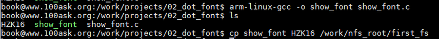
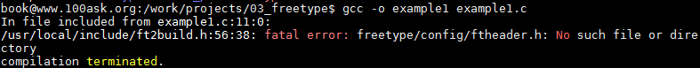

## 第 1 课 数码相框  (一共33节课时)

### 项目目录  

[第1节 数码相框之系统框架](#第1节-数码相框之系统框架)  
[第2节 字符的编码方式](#第2节-字符的编码方式)  
[第3节 英文和汉字的点阵显示](#第3节-英文和汉字的点阵显示)
#### 第1节 数码相框之系统框架  
1. [弄清需求](#弄清需求)
2. [设计框架](#设计框架)
3. [编写代码](#编写代码)
4. 测试

#### 弄清需求    
如果是在一开始的时候，并不能确定需求到底该是怎样的可以先考虑这个产品是怎么操作的。以手机为例，先可以考虑一下具体的操作是如何实现的：  
1. 上电之后，LCD显示了一副图片    
2. 根据配置文件，决定停留还是自动显示下一副图片  
3. 点击一下，出现对话框：确定是`手动/自动` 显示  
4. 根据上下左右判定图像是放大、缩小、下一幅、上一幅  
5. 左右移动过快，显示下下一副图片  

#### 设计框架    
大公司中的系统工程师，他们的主要责任，就是设计这款产品的框架。需要提供相关的文档，各个模块之间的接口是做啥的。  

以数码相框为例进行框架设计：  
1. [输入进程](#输入进程)  
2. 显示进程  

##### 输入进程  

为了得到触摸屏的数据，进程调用[tslib](https://baike.baidu.com/item/tslib/722869?fr=aladdin)来操作读取触摸屏的数据。  

这个`输入进程`也需要封装。需要封装的要素有：1. 事件 2. 时间 3. 类型 (点击、移动、位置) 4. 数据(位置、方向/速度/幅度)  
这些封装好了之后，需要使用`socket`发送给别的进程。  

2.显示进程  

里面需要多个线程，需要有负责接收`输入进程`的输出结果的。也需要处理进程要求的。    
使用库libjpeg来准备jpeg图片。  

考虑到有：`接收socket`、`主控`、`当前`、`左`、`右`、`上`、`下`。这7个功能，就要准备7个线程来处理它们。

总结：  
1. 输入进程需要包含：  
主控线程:得到上报的事件，使用`socket`发出  
触摸屏(ts)线程：使用tslib读触摸屏，封装事件并且上报  
按键线程:读按键，封装事件上报  
2. 显示进程需要包含:    
`socket`线程接收数据：接收`socket`信息。  
放大线程：准备好当前图片的放大的数据    
缩小线程：准备好当前图片的缩小的数据  
上一幅线程：准备好上一幅要保留的图片  
下一幅线程：准备好下一幅要保留的图片  
当前图片线程：准备好当前图片  
主控：根据`socket`线程准备好的信息(事件)，决定显示上下左右哪一幅图片  
线程之间可以实现资源的共享。  

3. 驱动程序：  
分配额外的5块内存，以及DMR、MMAP的操作。  

#### 编写代码  
编写代码也有两个方向可以考虑：1. 专家方向，某一类方向了解很深。2. 系统方向。    

| | libjpeg、mmap | |
- | :-: | :-: | :-: | -:
内存 | 内存 | 内存 | 

|framebuffer|
-|-|-
|LCD|

返回 [项目目录](#项目目录)  

#### 第2节 字符的编码方式  
开发板通过串口线(UART)接到PC机。PC机也有串口工具。发送ASCII数字显示为对应的文字。  

### 字符的编码方式  
分为四小节：  
- 2.1 [文字编码方式](#文字编码方式)  
- 2.2 [英文字母、汉字的点阵显示](#英文字母-汉字的点阵显示)  
- 2.3 [使用freestype来显示任意大小的文字](#使用freestype来显示任意大小的文字)  
    - 2.3.1 数码相框freetype理论介绍  
    - 2.3.2 数码相框在PC上测试freetype  
- 2.4 [编写一个通用的Makefile](#编写一个通用的makefile)  
##### 文字编码方式  
发展历史概述：
1. 开始阶段，欧美使用一个字节来表示。8位里面的低7位来表示字母。这就是ASCII码。  
2. 非英语国家介入，一个字节表示不够用了。要两个字节来表示汉字。用什么值来表示哪一个汉字。这就是`字符编码`，中国大陆有国标`GBK`。港澳台用`BIG5`字符编码。   
3. 开始统一编码：`unicode`编码。  

编码表表示的是数值和对应的字符/数字对应的关系。 `UTF-8`，`UTF-16LE`，`UTF-16BE` 。  
《[UTF-8, Unicode, GB2312格式串转换之C语言版](https://blog.csdn.net/ultraman_hs/article/details/69680956)》  

《[字符编码笔记：ASCII，Unicode 和 UTF-8](http://www.ruanyifeng.com/blog/2007/10/ascii_unicode_and_utf-8.html)》  

源文件用不同的编码方式编写，会导致执行结果不一样。    
怎么解决？编译程序时，要指定字符集  
输入命令：`man gcc` 在进行查找 `/charset`。  
`-finput-charset=charset` 表示输入源文件的编码方式, 默认以`UTF-8`来解析。  
`-fexec-charset=charset` 表示可执行程序里的字时候以什么编码方式来表示，默认是`UTF-8`。  

`gcc -o a a.c  //默认输入输出都是UTF-8`  
`gcc -finput-charset=GBK -fexec-charset=UTF-8 -o utf-8_2 ansi.c`  
返回：[字符的编码方式](#字符的编码方式)  
##### 英文字母、汉字的点阵显示  
代码参照：[show_font.c](../../03_source/digital-frame/02_dot_font/show_font.c)  
这部分内容更多的涉及APP层面，内核底层的改动需求不大。  

在LCD显示屏上面，显示一个英文字母,以及一个中文(字母 A 以及 “中” )。  

`显示原理`：LCD控制器链接LCD，LCD理解为是一个密集的点阵。内存`SDRAM`中有一块空间 `FrameBuffer` 也就是显存。LCD控制器从`FrameBuffer` 中取出若干字节的数据，代表一个像素。像素会被发送给LCD显示屏。字体通过字体点阵在 LCD 显示屏上面显示。  

内核中自然是有字符的点阵，在内核代码搜索 `font`,可以参照 `./drivers/video/console/font_8x16.c` 。8x16表示8列16行来表示一个字符，也就是16字节。  

```c{.line-numbers}
//参照font_8x16.c
#define FONTDATAMAX 4096
static const unsigned char fontdata_8x16[FONTDATAMAX] = {
    ...
    /* 65 0x41 'A' */    
    0x00, /* 00000000 */ 
    0x00, /* 00000000 */ 
    0x10, /* 00010000 */ 
    0x38, /* 00111000 */ 
    0x6c, /* 01101100 */ 
    0xc6, /* 11000110 */ 
    0xc6, /* 11000110 */ 
    0xfe, /* 11111110 */ 
    0xc6, /* 11000110 */ 
    0xc6, /* 11000110 */ 
    0xc6, /* 11000110 */ 
    0xc6, /* 11000110 */ 
    0x00, /* 00000000 */ 
    0x00, /* 00000000 */ 
    0x00, /* 00000000 */ 
    0x00, /* 00000000 */ 
//数字为1表示点亮了，否则就是暗的
}
```

参照代码：[show_font.c](../../03_source/digital-frame/02_dot_font/show_font.c)，位于03_source/02_dot_font/目录下。  

显示文字的大致步骤： 
1.打开对应的`/dev/fb`文件  
2.获得设备信息，通过ioctrl进行配置。可以参照fbmem.c  
3.映射内存mmap  
4.如果涉及到中文需要汉字库的初始化  

1.打开对应的`/dev/fb`文件  
```c{.line-numbers}
    fd_fb = open("/dev/fb0",O_RDWR);//打开fb设备文件
    if (fd_fb<0)
    {
        //打开失败
        perror("cannot open fb0");
        return -1;
    }
```
《[framebuffer缓冲帧/dev/fb0学习](https://blog.csdn.net/csdn66_2016/article/details/77894725)》  

2.获得设备信息，通过ioctrl进行配置。可以参照fbmem.c  
```c{.line-numbers}
    //2.获得设备信息，通过ioctrl进行配置。可以参照fbmem.c。
    //获得可变信息保存在fb_var_screeninfo中
    //fb_fix_screeninfo是固定信息
    //调用ioctl获取设置屏幕参数
    if (ioctl(fd_fb, FBIOGET_VSCREENINFO, &var) < 0) {
        perror("failed to get var info");
        close(fd_fb);
        return -1;
    }
    if (ioctl(fd_fb, FBIOGET_FSCREENINFO, &fix) < 0) {
        perror("failed to get fix info");
        close(fd_fb);
        return -1;
    }
```

3.映射内存mmap  
```c{.line-numbers}
//3.映射内存mmap
//屏幕大小 = xres*yres*(每个像素占据多少bit)/8
line_width  = var.xres * var.bits_per_pixel / 8;//一行有多少个像素
pixel_width = var.bits_per_pixel / 8;//每个像素的宽度
screen_size = var.xres * var.yres * var.bits_per_pixel/8;
fbmem = (unsigned char *)mmap(NULL, screen_size, PROT_READ | PROT_WRITE, MAP_SHARED, fd_fb, 0);
//NULL表示让系统分配地址
//length就是屏幕大小
if(fbmem == (unsigned char *)-1){
	printf("cant't mmap\n");
	close(fd_fb);
	return -1;
}
```
  

4.如果涉及到中文需要汉字库的初始化  
```c{.line-numbers}
	//汉字库的初始化
	fd_hzk16 = open("HZK16",O_RDONLY);
	if(fd_hzk16<0){
		printf("can't open HZK16\n");
		return -1;
	}
```

汉字库参照《[字符理论--hzk16的介绍以及简单的使用方法](https://blog.csdn.net/l_backkom/article/details/38414645)》  
HZK16 每个汉字16x16 = 2x8x16.  
'中'字'0xD6D0',其中'D6'表示区码，'D0'表示位码。  
其中每94个汉字就是一个区。位码表示在这个区里又是哪一位。汉字也不是从0开始的。0xD6 0xD0都需要减去A1。  

```shell{.line-numbers}
生成的文件show_font，以及汉字库HZK16拷贝到文件系统里去
cp show_font HZK16 /work/nfs_root/first_fs
```
但是内核还是需要配置：  
内核本身没有添加LCD的知识，需要添加这部分内容。  

测试:
1.配置、修改内核支持把lcd.c编译进去  
2.使用新内核启动  
```bash{.line-numbers}
当前目录为：/work/system/linux-2.6.22.6
cp /work/driver_and_test/10th_lcd/lcd.c drivers/video/
修改：vim drivers/video/Makefile
#obj-$(CONFIG_FB_S3C2410)         += s3c2410fb.o
obj-$(CONFIG_FB_S3C2410)          += lcd.o
```
该内核需要重新编译：`make menuconfig`
```
Device Drivers->Graphics support->Support for frame buffer devices
->S3C2410 LCD framebuffer support 输入Y编译进内核
```
重新编译内核：`make uImage`

  

添加相关文件到内核目录下去：  
  

返回：[字符的编码方式](#字符的编码方式)  
返回 [项目目录](#项目目录) 

##### 使用freestype来显示任意大小的文字  
[数码相框freetype理论介绍](#数码相框freetype理论介绍)  
[数码相框在PC上测试freetype](#数码相框在pc上测试freetype)    

##### 数码相框freetype理论介绍  
原有的点阵文件的字符大小是限定好的，不能缩放。要考虑到字体是可以缩放的，需要使用矢量字体。矢量字体文件存放字体的两要素：
1.若干条闭合曲线的关键点  
2.使用数学曲线（贝塞尔曲线）来描绘连接关键点  
3.填充曲线的内部空间  
使用`freetype`这个字库可以实现。  
电脑下的`C:\Windows\Fonts\`存有各种文体。例如宋体字文件`simsun.ttc`  
一个文字的显示过程：  
1.给定一个文字，例如'A' 0x41,可以确定它的编码值，charmap:支持哪些编码。    
2.根据编码值从字体文件中找到'glyph'，'glyph'包含关键点  
3.设置字体大小  
4.用某些函数把glyph里的点缩放为字体大小  
5.框里的像素点描黑，转换为位图点阵  
6.在LCD上显示出来  

代码的过程：  
1.包含头文件`ft2build.h`进行初始化  
```c{.line-numbers}
#include <ft2build.h>
#include FT_FREETYPE_H
```
2.加载字体 `Face` `FT_New_Face`打开字体文件，构造了一个Face   

3.设置字体大小  
`FT_Set_Char_Size`/`FT_Set_Pixel_Sizes`  

4.根据编码值加载'glyph'  
```c{.line-numbers}
//选择charmap FT_Select_Charmap 默认Unicode
glyph_index = FT_Get_Char_Index(face,charcode);//找到
FT_Load_Glyph(face,glyph_index);//取出
FT_Reader_Glyph();//转为位图
```
5.变换：移动、旋转  FT_Set_Transform

返回 [第2节 文字编码方式](#第2节-文字编码方式)  
返回 [项目目录](#项目目录)  

##### 数码相框在PC上测试freetype  

点开相关的 `example.c` 代码。  

```c{.line-numbers}
/* initialize library */
FT_Error      error;
error = FT_Init_FreeType( &library );

/* create face object 打开字体文件*/
error = FT_New_Face( library, argv[1], 0, &face ); 

/* 设置字符大小 */
error = FT_Set_Char_Size( face, 50 * 64, 0,100, 0 );

/* 设置转换参数 */
FT_Set_Transform( face, &matrix, &pen );

/* 加载得到位图 */
error = FT_Load_Char( face, chinese_str[n], FT_LOAD_RENDER );

/* 打印出来 */
draw_bitmap( &slot->bitmap, slot->bitmap_left, 
                target_height - slot->bitmap_top );
```

上传example.c和freetype-2.4.10.tar.bz2到Linux中。先解压freetype-2.4.10.tar.bz2。之后`./configure` 再make。make完成需要安装：`sudo make install`需要安装到根目录那里去。安装的地址为`/usr/local/lib/pkgconfig/freetype2.pc`  

这个时候直接进行gcc编译的话，还是会报错：  
 
但是在具体的目录下是可以找到的使用命令：`gcc -o example1 example1.c -I /usr/local/include/freetype2 -lfreetype -lm`  

使用命令：  
```shell{.line-numbers}
tar xjf freetype-2.4.10.tar.bz2 
./configure
make
sudo make install

gcc -o example1 example1.c  -I /usr/local/include/freetype2 -lfreetype -lm
gcc -finput-charset=GBK -fexec-charset=UTF-8 -o example1 example1.c  -I /usr/local/include/freetype2 -lfreetype -lm
./example1 ./simsun.ttc abc
```
在显示中文的过程中不能够直接使用 `char *str = "成龙abc";` 这里显示。因为汉字需要两个byte显示。所以导入宽字符：`wchar_t *wst = L"成龙abc";` 但是，需要添加头文件`#include <wchar.h>`。这里每个字符用四字节表示。  

但是如果使用宽字符，在编译的时候如果继续按照原有的方式编译会报错：
`converting to execution character set: Invalid or incomplete multibyte or wide character`  
这里需要指定字符集，编译命令需要修改：`gcc -finput-charset=GBK -fexec-charset=UTF-8 -o example1 example1.c  -I /usr/local/include/freetype2 -lfreetype -lm`告知使用了什么样的编码，这里输入编码是`GBK`，执行编码是`UTF-8`.  
返回：[字符的编码方式](#字符的编码方式)   
返回：[项目目录](#项目目录)  

##### 编写一个通用的Makefile  

返回：[字符的编码方式](#字符的编码方式)  
返回：[项目目录](#项目目录)   


#### 第3节 英文和汉字的点阵显示  

返回 [项目目录](#项目目录)  

参考资料：
[FreeType 字体引擎分析与指南](http://wenku.baidu.com/view/2d24be10cc7931b765ce155b.html)  

[HZK16应用示例](http://wenku.baidu.com/view/0774d20c52ea551810a68768.html)  

[点阵字库HZK12 HZK16 HZK24 ASC12 ASC16 简介及使用方法 ](http://blog.csdn.net/hongjiujing/article/details/6649618)  

汉字拼音、五笔、GB2312、GBK、Unicode、BIG5编码速查  


[BIG5编码表](http://wenku.baidu.com/view/9bb3ae01b52acfc789ebc970.html)  


[UNICODE编码表](https://www.cnblogs.com/csguo/p/7401874.html)  

[GB2312简体中文编码表](http://wenku.baidu.com/view/0ef57bfb04a1b0717fd5dd1a.html)  

[hzk16的介绍以及简单的使用方法](https://blog.csdn.net/l_backkom/article/details/38414645)  