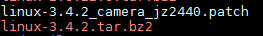

详细步骤：  
1. 先确保对应的文件是全的  


2. 打上原来的补丁  
```shell{.line-numbers}
   tar xjf linux-3.4.2.tar.bz2
   cd linux-3.4.2
   patch -p1 < ../linux-3.4.2_camera_jz2440.patch
```

3. 编译  
在内核目录下确定配置以及编译  
```shell{.line-numbers}
   cp config_ok .config
   make uImage
```

编译出错了：  
  
查看之后发现需要配置 arm-linux-gcc 4.4版本  
[在linux中安装arm-linux-gcc](https://blog.csdn.net/ddffyhg/article/details/88090616)  

但是考虑到这里是有多个编译器的，所以需要确定一下编译器的版本：  
保险起见，最好是用绝对路径确保编译器版本是正确的。  
  

或者：  
1. 修改环境变量   sudo vim /etc/environment    
6. 使环境变量生效 source /etc/environment  

  

这样编译出来的uImage比之前的要大了不少  
  
太大意味着要修改uboot。  

[内核3.4.2 出现Verifying Checksum ... Bad Data CRC](http://bbs.100ask.org/forum.php?mod=viewthread&tid=23386&extra=&highlight=bad%2Bdata%2Bcrc&page=1)  
[在uboot中给JZ2440开发板重新分区](http://bbs.100ask.org/forum.php?mod=viewthread&tid=10573&highlight=%B7%D6%C7%F8)  

如何编译u-boot?    
参照视频文件：  
`\006_u-boot_内核_根文件系统(新1期_2期间的衔接)\视频\第001课_U-boot分析与使用`  
在已经打好补丁的uboot内核里面：
1. 先配置`make 100ask24x0_config`  
2. make 内核得到u-boot.bin文件  

烧录新的u-boot.bin文件，同时别忘了根文件系统  

