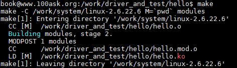
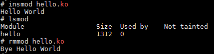
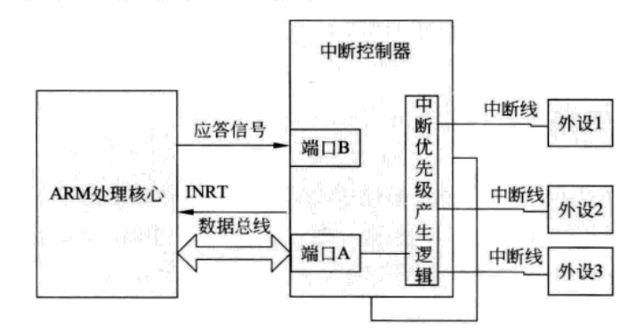
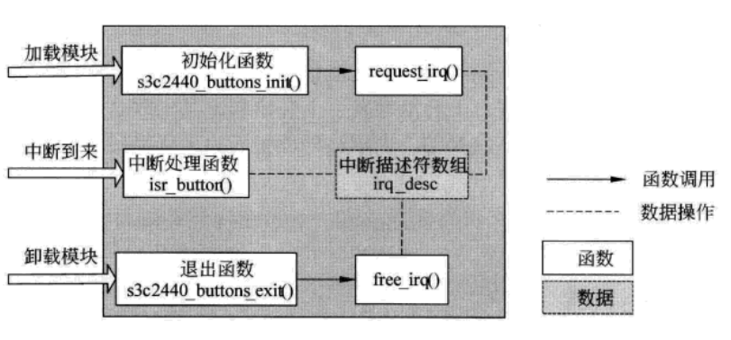

## Linux驱动开发

开发环境：基于韦东山的`JZ2440`  
内核版本：`Linux-2.6`  
参照资料：《[Linux驱动开发入门与实战](https://www.ituring.com.cn/book/1524)》  

### 目录  
[Linux驱动开发概述](#linux驱动开发概述)  
[构建第一个驱动程序](#构建第一个驱动程序)  
[简单的字符设备驱动程序](#简单的字符设备驱动程序)  
[字符设备驱动架构](#字符设备驱动架构)  
[设备驱动中的并发控制](#设备驱动中的并发控制)  
[设备驱动中的阻塞和同步机制](#设备驱动中的阻塞和同步机制)  
[中断与时钟机制](#中断与时钟机制)  
[内外存访问](#内外存访问)  
[设备驱动模型](#设备驱动模型)  

### Linux驱动开发概述  

设备驱动概述：是一个允许计算机软件与硬件交互的程序。  

设备驱动的分类  
1.字符设备    
2.块设备  
3.网络设备  

1.字符设备  
字符设备可以一个个字节读取数据的设备，LED 键盘 和鼠标。字符设备的驱动层要有open、close、read、write、ioctl函数。文件系统中有相关函数会调用这些函数。内核中对字符设备有对应的文件：`/dev/console`。字符设备不一定支持寻址。寻址：对硬件中的寄存器进行随机访问。不支持以为这使能对硬件寄存器进行顺序读取。读取了寄存器的数据之后，程序自己确定用那些数据。  

2.块设备  
类似磁盘，但是一次是一个或者多个块进行操作的。  

3.网络设备  
操作网络设备。  

用户控件只有应用程序和系统调用两部分。只有系统调用才能访问硬件设备。  

模块机制  
模块是运行时加入内核的代码。类似Windows中的DLL文件。  
按照装载的方式分为两种：如果是内核启动时装载就是`静态装载`，内核已经运行时称为`动态装载`。  

驱动模块基本架构：  
```c{.line-numbers}
#include <linux/kernel.h>
#include <linux/module.h>
#include <linux/init.h>

int __init xxx_init(void)
{
    //模块加载时的初始化工作
    return 0;
}

void __exit xxx_exit(void)
{
    //模块卸载时销毁工作    
}
module_init(xxx_init);  //指定初始化函数的宏
module_exit(xxx_exit);  //指定卸载函数的宏
```

需要的技能点：  
1.C语言基础  
2.可以理解芯片手册上面的设备配置  
3.内核源码的理解  
4.多任务设计  

应用程序VS驱动程序：  
内核、驱动程序不能使用C库，C库是在用户控件实现。  
驱动开发要用的是GNU C  
内核支持[异步中断](https://blog.csdn.net/jasonLee_lijiaqi/article/details/80181814)  

返回: [目录](#目录)  

### 构建第一个驱动程序  

[驱动模块要素](#驱动模块要素)  
[编写HelloWorld模块](#编写helloworld模块)  
[编译HelloWorld模块](#编译helloworld模块)  
[添加到内核](#添加到内核)  

编写驱动之前，需要先处理内核代码：  
输入命令：`tar -xjvf linux2.6.xxx.tar.bz2`  
配置内核：`make menconfig`  
编译内核：`make`  

编写第一个驱动模块HelloWorld  
这个HelloWorld本身不会对硬件有任何的操作，只是在加载这个模块的时候console输出"Hello World"卸载的时候"Bye Hello World"。这个驱动只是需要体现驱动的最基本部分。  

#### 驱动模块要素  
一个最基本的驱动程序最起码需要下面五点要素  
1. 头文件
```c{.line-numbers}
#include <linux/module.h> 
#include <linux/init.h> 
```
`module.h`文件包含了加载模块时需要的符合和函数定义。  
`init.h`文件包含了模块加载函数和模块释放函数的宏定义。  

2. 模块参数  
打算传递什么参数给驱动模块。但是不一定每次都需要。  

3. 模块加载函数    
通过这个加载到系统去，模块的初始化工作。模块怎么注册，需要初始化那些寄存器。    

4. 模块卸载函数  
释放资源  

5. 模块许可声明  
没这个模块用不了，但是声明大致如下。  

```c{.line-numbers}
module_init(xxx_init);    
module_exit(xxx_exit);    

MODULE_LICENSE("GPL");
```

#### 编写HelloWorld模块  

```c{.line-numbers}
#include <linux/kernel.h>
#include <linux/module.h>
#include <linux/init.h>

static int __init hello_init(void) 
{
    printk(KERN_ALERT "Hello World\n");
    return 0;
}

static void __exit hello_exit(void)
{
	printk(KERN_ALERT "Bye Hello World\n"); 
}                         
module_init(hello_init);
module_exit(hello_exit);

MODULE_LICENSE("GPL");
```
#### 编译HelloWorld模块  

1. 编译内核这里是linux-2.6版本的内核  
2. 编写驱动模块自己的Makefile  

```shell{.line-numbers}
KERN_DIR = /work/system/linux-2.6.22.6

all:
	make -C $(KERN_DIR) M=`pwd` modules 

clean:
	make -C $(KERN_DIR) M=`pwd` modules clean
	rm -rf modules.order

obj-m	+= hello.o
```
Line1 :`KERN_DIR`这里的是内核的位置。  
line10:`obj-m	+= hello.o`是表示hello.o会被编译成hello.ko模块。`ko`模块才是真的驱动模块。但是要注意既然是`hello.o`,那么对应的文件就该是`hello.c`.  

3. 编译模块  
输入make:  
  

编译完了，需要移动到对应的根文件系统目录。并且做个新的文件系统。  

   

#### 添加到内核  
使用insmod添加驱动模块的这叫做动态添加模块。如果需要随系统一起启动这个模块需要静态添加这个模块。  
1. 编写驱动文件  
2. 驱动文件放到Linux内核目录下，可能需要新建一个目录  
在linux-x.x/driver/目录下创建新的目录，所有的驱动代码都放到这个新目录下面。但是别忘了写一个新的`Kconfig`和`Makefile`文件。  

3. 在Kconfig文件中添加自定义驱动对应的项目编译选择  
4. Makefile文件中添加新驱动的编译语句  

***未完待续***

返回: [目录](#目录)  

### 简单的字符设备驱动程序  
  
[字符设备和块设备](#字符设备和块设备)  
[cdev结构](#cdev结构)  
[字符设备驱动组成](#字符设备驱动组成)   

#### 字符设备和块设备  
1. 字符设备  
只能一个字节的读取，不能随机读。例如，鼠标、键盘、串口控制台和LED。  
2. 块设备  
按照块进度读取，不一定要按照顺序来。常见：U盘、SD卡  
3. 怎么看，输入命令ls  
如果顶头有`c`字符表示字符设备，`b`表示是块设备。  
```shell
ls -l
```
#### 驱动设备号  

#### 主设备号和次设备号  
主设备号表示这是什么驱动，次设备号表示在主设备号下面是第几个。例如，两个LED。主设备号表示这是LED设备，次设备号表示这是第几个LED设备。  

1.设备号怎么表示  
Linux捏合中用dev_t表示，u_long在32位机是4字节，64位机是8字节。如果是32位机，高位12表示涉笔好，帝20表示次设备号。  

|  主设备号12位   | 次设备号20位  |  
|  ----  | ----  |

dev_t结构  
```c{.line-numbers}
typdef u_long dev_t;
```

2.主/次设备号怎么获得  
考虑到32位机和64位机的不同。首先尽量不要自己写。不同的芯片可能分配的设备号不一致。  
```c{.line-numbers}
#define MINORBITS	20
#define MINORMASK	((1U << MINORBITS) - 1)

#define MAJOR(dev)	((unsigned int) ((dev) >> MINORBITS))
//右移20位取头12位
#define MINOR(dev)	((unsigned int) ((dev) & MINORMASK))
//低20位获得20位
#define MKDEV(ma,mi)	(((ma) << MINORBITS) | (mi))
//获得主设备和次设备
```

#### 静态分配设备号  
开发者自己选定的设备号，但是要注意可能会有冲突。  

#### 动态分配设备号  
让系统给用户分配设备号。需要有申请和释放设备号这两个操作。    

怎么查看设备号：查看`/proc/devices`  

#### 申请和释放设备号  

可以使用函数申请设备号：`register_chrdev_region`,`register_chrdev`
《[register_chrdev_region()、register_chrdev()、 alloc_chrdev_region()函数的区别](https://blog.csdn.net/welbell_uplooking/article/details/83654312)》  
用完了别忘了释放：`unregister_chrdev`  

返回：[简单的字符设备驱动程序](#简单的字符设备驱动程序)  
返回: [目录](#目录)  

#### cdev结构  
申请设备号之后，需要注册到系统中去。才能生效。  
cdev结构体包含了字符设备的特性：  
```c{.line-numbers}
struct cdev{
    ...
    const struct file_operations *ops;
    ...
    dev_t dev;
}
```
驱动中需要通过file_operations结构体来完成注册。这样可以创建一个设备文件。驱动所有的调用函数都需要通过`file_operations`结构体来完成注册。常见的有：`open`、`read`、 `write`、`close`、`ioctrl`等方法。  

```c{.line-numbers}
//参照fs.h
struct file_operations {
	struct module *owner;
	loff_t (*llseek) (struct file *, loff_t, int);
	ssize_t (*read) (struct file *, char __user *, size_t, loff_t *);
	ssize_t (*write) (struct file *, const char __user *, size_t, loff_t *);
	ssize_t (*aio_read) (struct kiocb *, const struct iovec *, unsigned long, loff_t);
	ssize_t (*aio_write) (struct kiocb *, const struct iovec *, unsigned long, loff_t);
	int (*readdir) (struct file *, void *, filldir_t);
	unsigned int (*poll) (struct file *, struct poll_table_struct *);
	int (*ioctl) (struct inode *, struct file *, unsigned int, unsigned long);
	long (*unlocked_ioctl) (struct file *, unsigned int, unsigned long);
	long (*compat_ioctl) (struct file *, unsigned int, unsigned long);
	int (*mmap) (struct file *, struct vm_area_struct *);
	int (*open) (struct inode *, struct file *);
	int (*flush) (struct file *, fl_owner_t id);
	int (*release) (struct inode *, struct file *);
	int (*fsync) (struct file *, struct dentry *, int datasync);
	int (*aio_fsync) (struct kiocb *, int datasync);
	int (*fasync) (int, struct file *, int);
	int (*lock) (struct file *, int, struct file_lock *);
	ssize_t (*sendfile) (struct file *, loff_t *, size_t, read_actor_t, void *);
	ssize_t (*sendpage) (struct file *, struct page *, int, size_t, loff_t *, int);
	unsigned long (*get_unmapped_area)(struct file *, unsigned long, unsigned long, unsigned long, unsigned long);
	int (*check_flags)(int);
	int (*dir_notify)(struct file *filp, unsigned long arg);
	int (*flock) (struct file *, int, struct file_lock *);
	ssize_t (*splice_write)(struct pipe_inode_info *, struct file *, loff_t *, size_t, unsigned int);
	ssize_t (*splice_read)(struct file *, loff_t *, struct pipe_inode_info *, size_t, unsigned int);
};
```

```c{.line-numbers}
static struct file_operations xxx_drv_fops = {
    .owner   =  THIS_MODULE,    
    /* 这是一个宏，推向编译模块时自动创建的__this_module变量 */
    .open    =  xxx_drv_open,     
    .read    =	xxx_drv_read,	   
    .release =  xxx_drv_close,
    .poll    =  xxx_drv_poll,
    .fasync  =  xxx_drv_fasync,
};
```
`ioctrl` 执行设备命令的方法。  

返回：[简单的字符设备驱动程序](#简单的字符设备驱动程序)  
返回: [目录](#目录)  

#### 字符设备驱动组成  

字符设备的加载和卸载函数，这两部分工作主要在init函数和exit函数中完成。init函数中需要:1.申请设备号 2.完成cdev/file_operation结构体的初始化  

驱动和应用程序的数据交换：首先它们不能直接交换数据，因为他们的地址肯定不一致。需要使用内核提供的专用函数：  
```c{.line-numbers}
copy_to_user
copy_from_user
put_user
get_user
```
返回：[简单的字符设备驱动程序](#简单的字符设备驱动程序)  
返回: [目录](#目录)  


### 字符设备驱动架构  
详细可以参照[myleds.c](../../00_linux_driver/01chardev/leds/myleds.c)经典例子，需要多看。  
[驱动程序部分](#驱动程序部分)  
[应用程序部分](#应用程序部分)  

#### 驱动程序部分  
凡是应用层需要的各类函数xxx_open、xxx_read、xxx_write均在这里进行实现。  
首要是有对应的file_operations的初始化(用户代码段 `driver_function`)： 
```c{.line-numbers}
static struct file_operations xxx_drv_fops = {
	.owner  = THIS_MODULE,
	.open   = xxx_drv_open,
	.read	= xxx_drv_read,     
	.write	= xxx_drv_write,	   
};
```
同样还需要对应的模块加载和协议规范：  
```c{.line-numbers}
/* 这两行指定驱动程序的初始化函数和卸载函数 */
//s3c24xx_leds_init 这是命名习惯
module_init(xxx_xxx_init);
module_exit(xxx_xxx_exit);

MODULE_LICENSE("GPL");
```
1. [驱动函数的注册](#驱动函数的注册)  
2. [驱动函数的退出](#驱动函数的退出)  
3. [驱动模块函数实现](#驱动模块函数实现)  

#### 驱动函数的注册  
xxx_init  
1. 驱动函数入口  
```c{.line-numbers}
//register_chrdev(主设备号, 名字(可以随便写), 结构)
major = register_chrdev(0, "first_drv", &xxx_drv_fops);
//0表示自动分配
register_chrdev(LED_MAJOR, DEVICE_NAME, &s3c24xx_leds_fops);
//这里表示分配了主设备号
```
这个函数被xxx_xxx_init调用。调用注册函数register_chrdev的函数，也就是驱动函数的入口。 

2. 创建一个设备类,设备先要有这个类才能创建  
```c{.line-numbers}
static struct class *xxxdrv_class;
xxxdrv_class = class_create(THIS_MODULE, DEVICE_NAME);
```
在这个类下面创建一个设备    
[004_linux驱动之_class_create创建一个设备类](http://blog.sina.com.cn/s/blog_15992c4180102xrwj.html)  

3. 在设备类下面创建一个设备  
```c{.line-numbers}
static struct class_device *xxxdrv_class_dev;
xxxclass_dev = class_device_create(xxxdrv_class,NULL,MKDEV(major, 0),NULL,"DEVICE_NAME");
```
当我们使用class_create创建一个类之后我们就可以使用class_device_create函数在这个类下面创建一个设备了 
[005_LINUX驱动之_CLASS_DEVICE_CREATE函数](https://www.cnblogs.com/luxiaoguogege/p/9690216.html)  

4. 使用ioremap映射寄存器地址  
```c{.line-numbers}
volatile unsigned long *gpfcon = NULL;
volatile unsigned long *gpfdat = NULL;
gpfcon = (volatile unsigned long *)ioremap(0x56000050, 16);
gpfdat = gpfcon + 1;
```
ioremap在Linux中reg地址不能随便访问。  

#### 驱动函数的退出  

#### 驱动模块函数实现
1. [xxx_drv_open](#xxx_drv_open)  
2. [xxx_drv_read](#xxx_drv_read)  
3. [xxx_drv_write](#xxx_drv_write)  
#### xxx_drv_open:  
```c{.line-numbers}
static int xxx_drv_open(struct inode *inode, struct file *file)
{
	//regs conf
	return 0;
}
```
[linux驱动开发--copy_to_user 、copy_from_user函数实现内核空间数据与用户空间数据的相互访问](https://blog.csdn.net/xiaodingqq/article/details/80150347)  

驱动函数和应用程序之间的数据交换，不能够直接相互访问。因为，他们的地址空间往往是不一样的。  
这就需要内核提供的相互交换数据的函数：  
```c
/*内核空间->用户空间交换数据*/
copy_to_user //xxx_drv_read 中调用
/*用户空间->内核空间交换数据*/
copy_from_user //xxx_drv_write 中调用
```
#### xxx_drv_read:  

```c{.line-numbers}
ssize_t xxx_drv_read(struct file *file, char __user *buf, size_t size, loff_t *ppos)
{
	return 1;
}
```
#### xxx_drv_write:  
应用程序传进来的是`buf`,需要向下面的硬件传递
```c{.line-numbers}
static ssize_t xxx_drv_write(struct file *file, const char __user *buf, size_t count, loff_t * ppos)
{
	int val;
	copy_from_user(&val, buf, count);
	//app:write(fd, &val, 4);
	//set regs 
	return 0;
}
```

返回：[驱动程序部分](#驱动程序部分)  

#### 应用程序部分
main函数内调用open、read、write 等函数。具体实现全部参照[驱动程序部分](#驱动程序部分)  

考虑到是在Linux开发板上面运行，需要交叉编译：
```shell{.line-numbers}
arm-linux-gcc -o firstdrvtest firstdrvtest.c
```
但是要注意的是，应用层打开的设备名得和驱动层的名字一致：  
```c{.line-numbers}
//APP 设备名 led
fd = open("/dev/led", O_RDWR);
//对应的驱动设备名字也得是 led
#define DEVICE_NAME     "led"
major = register_chrdev(0, DEVICE_NAME, &led_drv_fops);
led_drv_class = class_create(THIS_MODULE, DEVICE_NAME);
led_drv_class_dev = class_device_create(led_drv_class, NULL, MKDEV(major, 0), NULL, "led");
```

查看添加上去的设备情况：  
```shell{.line-numbers}
ls -l /dev/led
crw-rw----    1 0        0        252,   0 Jan  1 00:00 /dev/led
```
主设备号252，次设备号0  

返回: [目录](#目录)  

### 设备驱动中的并发控制  
操作系统3大特性：中断处理、多任务处理和多处理器。但是同一资源部能让多个进程线程同时访问。需要使用并发控制。  

并发就是多个进程都在运行，但是如果多个进程同时访问同一个资源的时候就会有`竞争`。  

为了避免`竞争`，也就是确保操作过程不会被打断的操作。导入：[原子变量操作](#原子变量操作)、[自旋锁](#自旋锁)、[信号量](#信号量)和[完成量](#完成量)。  

#### 原子变量操作  
绝不会在执行完毕之前被打断。功能太简单，只能做计数操作。该counter变量保存在内存中，不要放到寄存器里。  
```c{.line-numbers}
#include/asm/atomic.h
typedef struct{
	volatile int counter;
}atomic_t;
```
具体有两种操作：[原子整形操作](#原子整形操作)、[原子位操作](#原子位操作)  

#### 原子整形操作  
需要共享的资源就是一个简单的整型数值。atomic_t这里就是个int类型的值。这里使用atomic_t类型的count变量。但是对这个atomic_t变量的加减操作只能通过Linux内核中的函数完成。不能直接的加一或者减一  
具体的设置有这么几种：1.定义atomic_t变量、2.设置atomic_t变量的值、3.读取atomic_t变量的值、4.原子变量的加减法、5.原子变量的自加自减。  

1. 定义atomic_t变量   
```c{.line-numbers}
//定义相关类型的变量：  
//acenic.h
atomic_t		cur_rx_bufs;
```
2. 设置atomic_t变量的值  
```c{.line-numbers}  
//acenic.c
atomic_set(&ap->cur_rx_bufs, 0);
```
3. 读取atomic_t变量的值  
```c{.line-numbers}  
//acenic.c
int cur_size;
cur_size = atomic_read(&ap->cur_rx_bufs);
```
4. 原子变量的加减法  
```c{.line-numbers}
//acenic.c
atomic_add(i, &ap->cur_rx_bufs);
atomic_sub(std_count, &ap->cur_rx_bufs);
```
5. 原子变量的自加自减  
```c{.line-numbers}
//6pack.c
atomic_inc(&sp->refcnt);
//6pack.c
atomic_dec(&ap_poll_requests);
```
#### 原子位操作  
对数据的每一位进程操作。而数据不一定非要是atomic_t类型的变量。  

返回：[设备驱动中的并发控制](#设备驱动中的并发控制)  

#### 自旋锁  
原子操作能够操作的内容实在太少，导入锁的概念。锁有两种一种是自旋锁，还有一种信号量。  
自旋锁类型是 struct spinlock_t，对该类型有相关函数进程操作。  
参照内核代码：linux-2.6.22.6/drivers/net/tokenring/3c359.h  
linux-2.6.22.6/drivers/net/tokenring/3c359.c  

1. 定义和初始化自旋锁  
```c{.line-numbers}
//定义自旋锁变量
spinlock_t xl_lock;
//初始化自旋锁
static int __init xl_init(struct net_device *dev) 
{
	...
	spin_lock_init(&xl_priv->xl_lock) ; 
	...
}
```
2. 锁定/释放自旋锁 
```c{.line-numbers}
static irqreturn_t xl_interrupt(int irq, void *dev_id) 
{
	...
	//锁定自旋锁
	spin_lock(&xl_priv->xl_lock) ; 
	...
	//释放自旋锁
	spin_unlock(&xl_priv->xl_lock) ; 
	...
}
```
不一定，只能在哪个函数中使用spin_lock函数，只需要确定这部分临界资源确实需要锁上。可以理解为是一段的代码操作部分锁上了。  

还有两个函数：spin_lock_irqsave、spin_unlock_irqrestore。看的出来，这两个函数都涉及到了中断(irq)处理的部分。  
[Linux内核spin_lock、spin_lock_irq 和 spin_lock_irqsave 分析](https://blog.csdn.net/wh_19910525/article/details/11536279)  

自旋锁的注意事项：1.自旋锁是忙等待，不满足条件就会持续等待。应该尽量用短时间的操作 2.不能递归使用  
如果自旋锁已经锁上了这部分临界资源，其它的自旋锁就是等待。  

返回:[设备驱动中的并发控制](#设备驱动中的并发控制)  
返回: [目录](#目录)  

#### 信号量  
Linux有两种信号量：内核中使用，应用程序中使用。驱动中需要的是内核的信号量。  
信号量使用方式和自旋锁类似，但是如果这个进程进入的临界资源已经“锁上”了。信号量的处理方式和自旋锁有区别：  

>进程进入一个等队列去睡眠，直到拥有信号量的进程释放了信号量之后。唤醒这个睡眠的进程。唤醒的进程从睡眠的地方开始执行，并且要获得信号量。获得信号量之后进程继续执行。  

这就要求使用信号量的进程要能够`睡眠`，中断函数需要立刻完成，就不能使用信号量。  
从信号量在Linux的代码来看有自旋锁、count以及一个等待队列wait_list。  
```c{.line-numbers}
struct semaphore{
	spinlock_t lock;
	unsigned int count;
	struct list_head wait_list;
};
```
lock自旋锁的目的就是保护count变量，需要修改count的时候lock先来锁定，修改完成，lock锁会释放。  

count变量的三种值：  
0表示信号量被其它进程使用，现在用不了这个信号量。但是wait_list队列中没有进程等待信号量  
小于0的值，至少一个进程在wait_list中等待  
大于0的值，信号量空闲，程序可以用  

自旋锁只接受一个进程持有，信号量可以是多个。  
信号量的使用  
1. 定义和初始化自旋锁  
```c{.line-numbers}
//airo.c
struct semaphore sem;
sema_init(&ai->sem, 1);//大于0信号量可以使用
//
```
2. 锁定信号量  
```c{.line-numbers}
down(&ai->sem);//该函数可能会导致睡眠不能在中断处使用
locked = down_interruptible(&ai->sem);//可以处理中断部分
if(down_interruptible(&ai->sem))
{
	return -ERESTARTSYS; //检查唤醒原因
}
```
3. 释放信号量  
```c{.line-numbers}
up(&ai->sem);
```
4. 使用信号量的大致方式  
```c{.line-numbers}
struct semaphore sem;
int xxx_init(void)
{
	...
	sema_init(&sem, 1);//init_MUTEX(&lock);
	...
}
//文件打开函数
int xxx_open(struct inode *inode, struct file *filp)
{
	...
	//锁定不允许访问临界资源
	down(&sem);
	...
}
//文件释放函数
int xxx_release()
{
	...
	up(&sem);
	...
}
```

信号量互斥：初始化值是0，意味着同步，线程A会一直等待，知道线程B执行完之后并up释放结束。  

自旋锁和信号量的选择：如果完成很快那就用自旋锁，因为睡眠的耗时不短。睡眠需要进程的上下文切换。如果，进程占用时间比切换时间长很多的时候就用信号量。  


返回: [设备驱动中的并发控制](#设备驱动中的并发控制)  
返回: [目录](#目录)  

#### 完成量  

一个线程发送一个信号通知另一个线程开始执行，这就是完成量。  
```c{.line-numbers}
#include/linux/completion.h
struct completion{
	unsigned int done;
	wait_queue_head_t wait;
}
```
done初始化为1，done不可能小于0.等于0表示这个完成量的线程现在是等待状态。大于零表示等待完成量的函数可以执行不要等待。  

完成量使用  
1. 定义和初始化完成量  
```c{.line-numbers}
struct completion execution_cmd;
init_completion(&lp->execution_cmd);
```
2. 等待完成量  
```c{.line-numbers}
wait_for_completion(&lp->execution_cmd);
```
等待过程中不会被信号中断，如果没有线程完成这个完成量那么wait_for_completion的线程会继续等待下去，线程不会退出。  
3. 释放完成量  
```c{.line-numbers}
complete(&lp->execution_cmd);
complete_all(&lp->execution_cmd);
```
释放完成量也就是唤醒。  

返回: [设备驱动中的并发控制](#设备驱动中的并发控制)  
返回: [目录](#目录)  

### 设备驱动中的阻塞和同步机制  

阻塞调用：返回前，线程是`挂起`的。有了结果才返回。  
不同于同步，因为同步的时候线程还是激活的。  
非阻塞调用：不能立刻得到结果之前，函数`不会阻塞`当前线程，会`立刻返回`。  
非阻塞或反复查询，直到可以进行操作为止，被调用的函数不会阻塞当前进程，而会立刻返回。  
等待队列  
阻塞进程用等待队列来实现。  
```c{.line-numbers}
struct __wait_queue_head {
	spinlock_t lock;
	struct list_head task_list;
};
```
两种数据结构：等待队列头（wait_queue_head_t）和等待队列项（wait_queue_t）  

等待队列的使用  
1. 定义和初始化等待队列头  
```c{.line-numbers}
//adb.c
#define current		get_current()
wait_queue_head_t wait_queue;
init_waitqueue_head(&wait_queue);
```
2. 定义等待队列（等待队列项）  
```c{.line-numbers}
#define current		get_current()
wait_queue_t wait = __WAITQUEUE_INITIALIZER(wait,current);
```

3. 添加和移除等待队列  
```c{.line-numbers}
add_wait_queue(&state->wait_queue, &wait);
//add_wait_queue函数讲等待队列元素wait添加到等待队列头wait_queue
//所指向的等待队列链表中。对应相反的就是
remove_wait_queue(&state->wait_queue, &wait);
```
4. 等待事件  
```c{.line-numbers}
wait_event(wq,condition);//直到condition为真为止。
```
5. 唤醒等待队列  
```c{.line-numbers}
wake_up
```

阻塞在I/O操作暂时不能进行时，进程进入等待队列。  
非阻塞在I/O操作暂时不能进行时，立即返回。  

返回: [设备驱动中的阻塞和同步机制](#设备驱动中的阻塞和同步机制)  
返回: [目录](#目录)  

### 中断与时钟机制  
系统有必要知道硬件的状态，需要使用中断。中断就是暂停正在进行的程序，转去执行突发的事情。  

中断在Linux是用信号实现的，发送信号给处理器。  
程序需要先申请中断，添加中断的处理函数。中断信号的到达和中断处理函数的调用，都是内核框架完成的。  
驱动程序中要确保的是中断号正确和中断处理函数。  

中断分类  
1. 硬中断：系统硬件产生，外部的随机事件触发。  
2. 软中断：程序执行触发。  

中断产生位置分类  
1. 外部中断：外设设备发出，键盘中断、打印机中断定时器中断。程序可以屏蔽（例如，不让手机接收来电）  
2. 内部中断：硬件出了问题（计算溢出，除数为零）可以触发中断。此类中断不能屏蔽。Linux内核会处理这些，驱动程序员不太需要关注。  

同步中断：整个过程CPU控制，在执行过程中，就算有中断，只要指令没执行完，CPU就不会执行中断处理。一般都是程序错误导致。  
异步中断：硬件随机产生，不考虑时钟的同步。  

#### 中断实现  
中断信号线(IRQ)：中断输入线和中断输出先都是信号线，都是引脚。为了区分IRQ先都有编号。这些编号也叫中断号，写驱动程序的时候来指定。  

中断处理过程：  
1. 外设产生中断信号，中断信号发送给中断控制器。  
2. 中断控制器检测IRQ线，如果IRQ上面有信号。也就是有中断，那就处理优先级高的。也就是中断编号小的IRQ线。  
3. 中断控制器收到的信号放在I/O端口A中，这个端口与CPU连接。  
4. 中断控制器发送信号给CPU的INTR引脚，CPU会分析信号。  
5. 发送信号给端口B给中断控制器  
6. 中断处理函数响应  



中断安装与释放  
需要在代码中设置是哪一个中断号，对应哪个中断处理函数。  
需要调用函数`request__irq`传入参数：  
1. irq中断号，硬件原理图决定的  
2. handler中断处理函数是什么  
3. 触发中断的属性  
4. 设备名  
5. 不一定需要可以是NULL  

  

看的出大致三个地方需要关注  
1. 加载模块init函数中`request_irq`  
2. 编写对应的中断处理函数  
3. 卸载模块exit函数中`free_irq`  

#### 时钟机制  
驱动使用时钟主要是为了延时时间，确保硬件设备完成任务。  
时间度量  
全局变量HZ，下面定义了每一秒中断发生了1000次。时钟中断发生时候，内部计数器值会加1。  
```c{.line-numbers}
#define HZ 1000
```
返回: [中断与时钟机制](#中断与时钟机制)  
返回: [目录](#目录)  

### 内外存访问  

内存分配需要`kmalloc()`和`vmalloc()`函数等。  
kmalloc函数为程序分配的是一个连续的存储空间。这个空间不会被清零。原有数据会留下。  
```c{.line-numbers}
static inline void *kmalloc(size_t size, gfp_t flags);
```
size参数：分配的内存池是固定的，都是2的整数倍。就算不足也是2的整数倍。  
vmalloc函数分配虚拟地址连续，但是物理地址不连续的内存。vmalloc开销大于`__get_free_pages`vmalloc需要建立新的页表。  
```c{.line-numbers}
void *vmalloc(unsigned long size);
void vfree(const void *addr);
```
[Kmalloc和Vmalloc的区别](https://blog.csdn.net/liujianfei526/article/details/77824644)  
[虚拟内存与物理内存的联系与区别](https://blog.csdn.net/lvyibin890/article/details/82217193)  

后备高速缓存：如果反复分配同一块内存块，频繁的将内存释放掉。这会导致内存碎片。需要使用内存池来处理。内存池用slab分配器来处理。  
1. 创建slab缓存函数  
调用`kmem_cache_create`创建slab缓存。

返回: [内外存访问](#内外存访问)  
返回: [目录](#目录)  

### 设备驱动模型  


返回: [设备驱动模型](#设备驱动模型)  
返回: [目录](#目录)  
